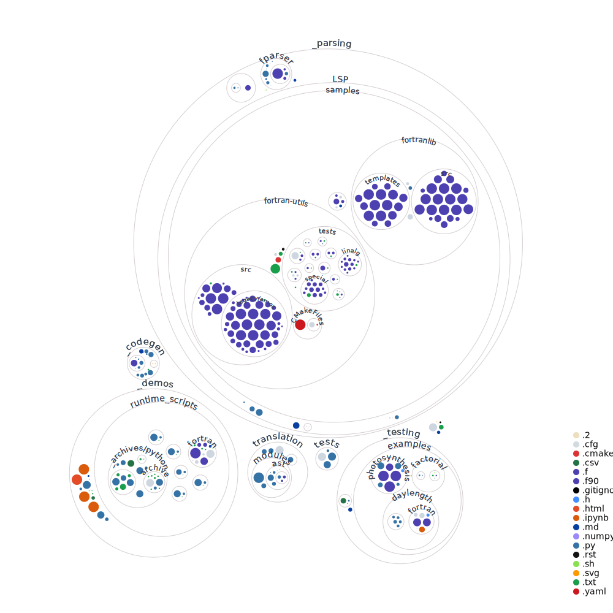

# Climate Code Conversion

Converting Fortran code in climate models to Python code using ChatGPT. 

This work was presented at the Tackling Climate Change with Machine Learning Workshop at NeurIPS 2023.

Access the corresponding workshop paper here:
[Proof-of-concept: Using ChatGPT to Translate and Modernize an Earth System Model from Fortran to Python/JAX](https://arxiv.org/abs/2405.00018)

## Dependencies

Assuming you are running Ubuntu:

1. Install Python 3. 
5. `pip install -r requirements.txt` to install all Python packages
6. `pip install -e .` to  add the local `translation` package to your path (needed for absolute imports)

## Running the CLI

To run the CLI, call `python ./translation/main.py`. This is a work in progress. 

## Folder Structure

`_codegen`, `_parsing`, and `_testing` contain independent subroutines for doing those things.  
`_demos` contains Python notebooks demonstrating the results shared in the paper. 
`tests` contains unit tests for the `translation` module.
`translation` contains the `translation` module, which is primarily a CLI used to translate code automatically. 

You can think of `translation` as a work-in-progress attempt to combine the insights from getting good at `_codegen`, `_parsing`, and `_testing`, even though each can be used individually.

## Visualization

Here's a visual representation of the folder structure, courtesy of GitHub Next's [repo visualizer](https://github.com/githubocto/repo-visualizer):

