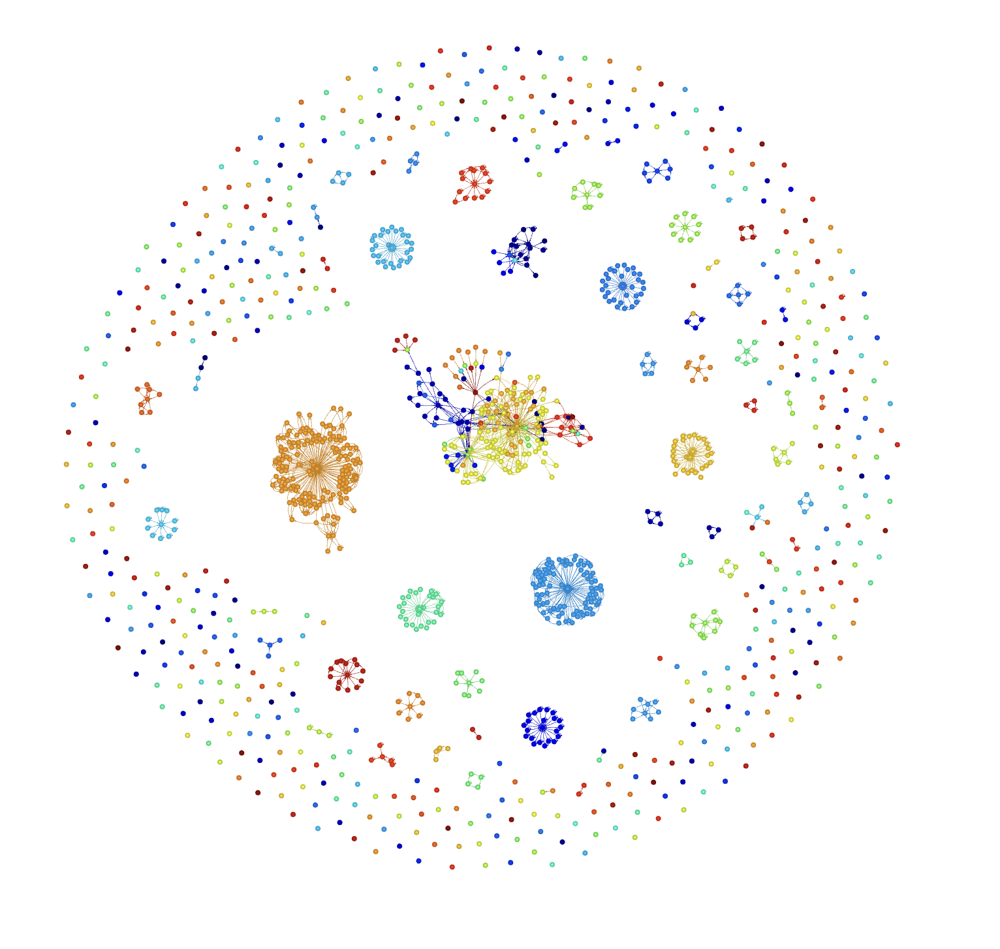

This is a utility that, given a Fortran project, computes a dependency graph. For example:

Interactive demos:
[https://anthonyzhou.com/demos/fortran_dependency_graphs](https://anthonyzhou.com/demos/fortran_dependency_graphs)
## How it works

First we find a list of all files in the project. Then, for each file, we do the following:

First, identify all of the available names defined in the file. For each name, we look through the symbols defined inside that function, to see whether any are defined externally. If they are, then we'd better go to that file and continue looking. 

Once we find the definition of a function/type called from another function/type, we record a few things:

1. name of the symbol
2. line numbers and column numbers of the definition
3. source code of the definition
4. filepath where the symbol is defined

These properties uniquely define a *node* in the graph, which is then given an outgoing connection to the function/type that calls it. 

By the time we finish, we should have assembled a DAG from all of the functions in the project. 

At this point, there are a couple interesting queries we can run:

1. View dependencies between modules
2. View dependencies for a given function (visualize the whole subset of the DAG)
3. Browse the whole DAG, color-coded by module name
4. View all definitions in topological sort order. 

Why can't we just see which modules depend on each other, without regard to specific names? The downside of this approach is that we'd need to translate whole modules at a time. But maybe this is better anyways, since otherwise we might be writing one function at a time to a Python file, which might result in weird conflicts and errors as ChatGPT lacks context for what came before. 

So what we want is actually two separate graphs. One graph contains modules and their corresponding dependencies. One graph contains a DAG for an individual source code file. Yet another graph might construct such a DAG from the lines of code within a single file (if the file is too large to fit into a single context window). 

The reason we care about specific dependencies from a module (and not just that a module depends on another module) is due to the technicalities of converting a codebase using a langauge model. Specifically, we don't want to pass in the entire interface of every module that is imported by a given module. Instead, we only want to pass in the functions that a function would need to call in order to be translated properly. Thus, we should try to get this specific information when possible, before falling back to whole-module dependencies. 

I'm looking at the Fortran `stdlib` library on GitHub and it's changing my mind. Much of the library is written using `fypp`, a preprocessor for Fortran. I have a feeling that even `fortls` would do a bad job of determining interdependencies with a custom build setup like this. Any kind of preprocessing, honestly, seems to suffer from this kind of problem. Then again, we could probably run some `fypp` program to preprocess things as needed -- same goes from `gcc` preprocessing. Is this better than using a full language model structure (using embeddings to retrieve relevant chunks of the codebase?). For now I will assume so, until someone proves otherwise. My hunch is that language models will simply fail more often, as they fail to discover all the relevant modules for a translation. 

So to conclude, I think that we should proceed as originally planned and determine the dependencies for every function. Worst case, we will have developed a nice tool for visualizing modules in Fortran. Best case, we will have developed a solid foundation to approach generalized translation tasks in all languages, thanks to the universal nature of LSP. 

## Features

Generate a DAG from a fortran project, with a node for each symbol and an arrow for each reference. The DAG is color-coded by module. 

Since this uses LSP, a similar approach can be applied quite directly to [any language supporting LSP](https://langserver.org/).

## Running the code

First install the dependencies. Then run the code:

`python dag.py`

## Coming up

- Isolate the dependencies for a single symbol (e.g., a module)
- Output source code given such a set of dependencies (needed for ChatGPT code generation usage)

## Limitations

This implementation is less than ideal. 

1. `fortls` notably doesn't have a good parser implemented yet (https://github.com/fortran-lang/fortls/issues/85). Once they integrate the LFortran parser this should be solved.
2. `fortls` doesn't know about your build process, such as when you pull in modules from other folders. For example, on the `fortran-utils` example, the DAG doesn't recognize that the test files depend on the module files -- `fortls` can't find the modules from the test files. 

A better approach might be to go directly to the AST from LFortran. This has the advantage of correctly finding all symbols in the Fortran, and the disadvantage of not having a "go to definition" option. This would solve (1) but not (2).

But I also think (2) could just be an implementation error, not a fundamental limitation of `fortls`. By solving (1) and (2) -- which might only take a few days of work -- we should have a pretty complete solution to this problem. 

## Credits

Samples are drawn from across GitHub:

- https://github.com/modern-fortran/tcp-client-server
- https://github.com/astrofrog/fortranlib
- https://github.com/certik/fortran-utils

This work builds upon the work of `fortls` and `fortran-language-server`, as well as the creation of the LSP standard. 